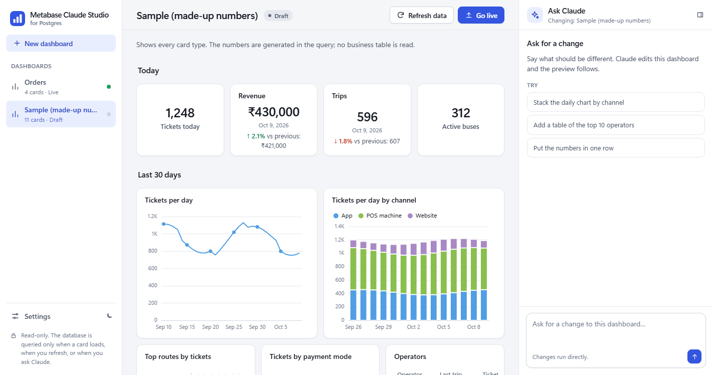
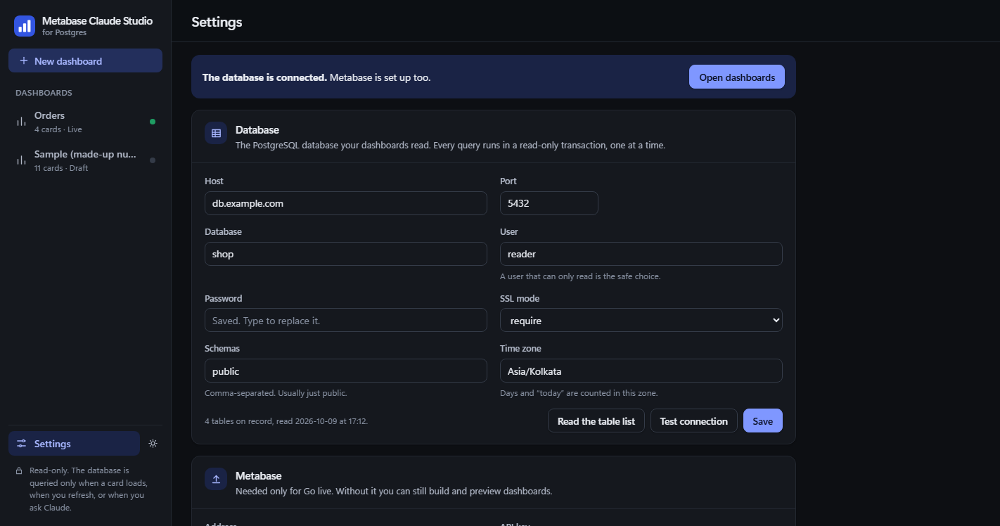
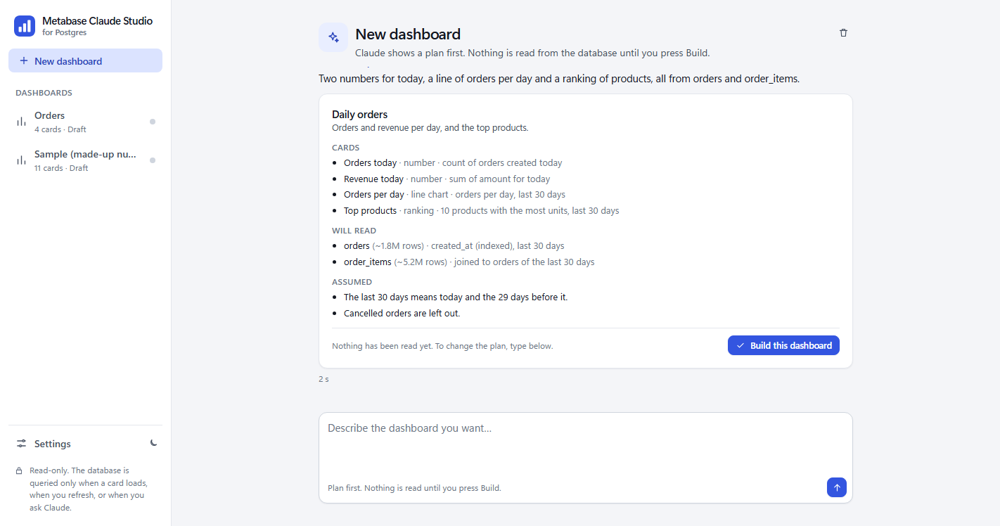
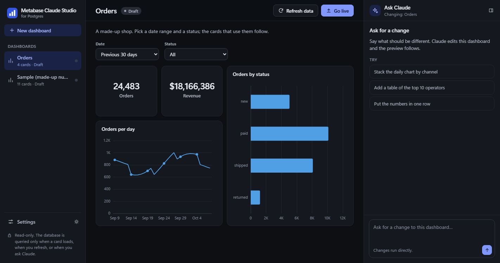

# Metabase Claude Studio for Postgres

Describe a dashboard in plain words. Claude Code drafts it on your PostgreSQL database,
you look at it with real data on your own PC, and one click publishes it to Metabase as
a native dashboard.

It is for Metabase installs that do not have Metabase's own AI or MCP features, such as
the open-source edition. All it needs from Metabase is an API key.

Runs only on your machine. Not affiliated with Metabase, Anthropic or PostgreSQL.



The numbers in these pictures are made up.

## What you need

- Windows 10 or 11, with Chrome or Edge.
- Python 3.11 or newer.
- [Claude Code](https://code.claude.com/docs/en/setup), installed and signed in (`claude`
  works in a terminal).
- A PostgreSQL database. A user that can only read is the safe choice.
- For publishing: Metabase with an API key. Tested on Metabase 0.55.

## Start

1. Clone this repository.
2. Double-click `Launch Metabase Claude Studio.vbs`. The first start builds `.venv` in a
   console window (once, needs the internet), then opens the app in its own window.
3. The app opens on its setup page:
   - **Database:** fill it in, press "Test connection", "Save", then "Read the table list".
   - **Metabase:** the address and an API key, "Check", then pick the database and the
     collection for new dashboards. This can wait until you want to go live.
   - **Claude:** it finds Claude Code by itself. "Check the sign-in" sends one short
     request.



For a desktop shortcut and a taskbar pin, see [docs/SHORTCUT.md](docs/SHORTCUT.md).
From a terminal instead: `python studio.py` prints a link and opens it in a browser tab.

Closing the window stops everything. Starting it again while it runs opens a second
window onto the same app.

## Use

**A new dashboard.** Press "New dashboard". It opens its own screen: describe the
dashboard there. Claude first answers with a plan: the cards, and the tables it will read
with the filter it will use. Nothing is read from the database until you press "Build
this dashboard". When it is built, the dashboard opens with the Ask Claude panel beside
it for changes.



**A change.** Open a dashboard and type the change. Changes run directly.

**Filters.** Ask for "a date filter and a status filter" and the dashboard gets a filter
row: a date range with presets, and dropdowns or text boxes. They filter the preview and
become native Metabase filters at Go live. A dropdown's choices are taken as they were
when you last opened the dashboard here, so opening the list in Metabase runs nothing.
Metabase counts days in its own report time zone. Go live warns when it differs from the
studio's, so that a date filter means the same days in both.



While Claude works the panel lists each step, and Stop ends it at once. Each card has
Table, SQL and Refresh tools (move the mouse over the card).

**Go live** publishes the open dashboard to Metabase. It first shows what will happen,
and nothing is sent until you confirm. A later Go live updates the same dashboard. The
label beside the title says where a dashboard stands: Draft, Live, "Changes not live",
or what became of it in Metabase (trashed, deleted, moved).

**Remove.** The bin button beside Go live takes a dashboard out of the studio. Its files
move to `data/trash/`, from where they can be put back by hand. Metabase is not touched.

## How it stays safe

**The database**

- Every query is checked to be one SELECT, then run as a subquery inside a read-only
  transaction, one at a time, with a time limit (30 s by default) and a row cap.
- A query the planner rates as heavy is not run until you press "Run anyway". Claude
  cannot override that.
- Values in columns that look like personal data (phone, email, tokens and so on) are
  hidden, and such a card cannot be published.
- Nothing runs on its own. The database is queried only when a card with a new query is
  shown, when you press Refresh, or when Claude tests a query for a request you made.
  Results are kept on disk, so reopening the app costs no query.
- Every query is written to `data/logs/queries.log` with its source.

**Claude**

- Runs headless (`claude -p`) with the sign-in you already use in a terminal.
- Its tools: list tables, describe a table, run a query, check a dashboard, read files
  in this folder, and write inside the one dashboard folder it is working on.
- No shell, no files outside this folder, nothing from `data/`, no Metabase access.
- A plan cannot run queries at all. A build may run at most 40 per request.

**Metabase**

- Go live writes only into the one collection you chose and uses only the one database
  you chose. Before any write, every recorded id is checked to sit in that collection.
- It runs no query. Metabase runs the cards when someone opens the dashboard there.
- The API key stays with the local server. The page and Claude never get it.

**The local server**

- Listens on 127.0.0.1 only, and answers only the window the launcher opened: every
  request needs that launch's session cookie, and other sites' requests are refused.

## Preparing Metabase

Not required, but it keeps the key's reach small:

1. Give the studio its own collection and its own group. Let the group curate that
   collection and write SQL questions on the one database.
2. Create the API key in that group (Admin > Settings > Authentication > API keys).
3. For the Metabase database connection itself, a read-only database user, and in
   "Additional JDBC connection string options":
   `options=-c%20statement_timeout%3D30000%20-c%20default_transaction_read_only%3Don`

Metabase adds the rights of its "All Users" group to every key. The Metabase "Check"
in Settings tells you when a key can reach more than you meant.

## Where your data lives

| Folder | Holds | In git |
|---|---|---|
| `dashboards/` | Your dashboards: `dashboard.json` and one `.sql` per card | No |
| `data/` | Settings, saved secrets, the table list, conversations, cached results, logs | No |
| `examples/sample/` | The example dashboard a new install starts with | Yes |

The database password and the Metabase key are stored encrypted for your Windows user
(DPAPI). The settings file is useless on another PC or to another user. On other
systems they are stored as they are, in a file only you may read.

To keep your dashboards under version control, run `git init` inside `dashboards/`.

## Settings

| Setting | Default | Meaning |
|---|---|---|
| Schemas | `public` | Which schemas Claude sees |
| Time zone | `UTC` | The zone "today" and days are counted in |
| Query time limit | 30 s | The database stops a query after this long |
| Heavy-query limit | 500,000 | A query the planner rates above this waits for "Run anyway" |
| Rows per card | 2,000 | Most rows fetched for one card |
| Queries per request | 40 | Most queries Claude may run for one request |
| Model | account default | `sonnet` uses less of your Claude limit |
| Appearance | match the system | Light or dark |

## Commands

```
python studio.py                   start the studio in a browser tab
python studio.py tables [text]     list tables (local snapshot)
python studio.py describe <table>  columns, indexes and links of one table
python studio.py q "<select ...>"  run one read-only query
python studio.py check <slug>      check a dashboard's files
python studio.py snapshot          refresh the table list (catalog only)
python studio.py doctor            what the Metabase key can reach
python studio.py info              the time zone, schemas and limits in force
```

The same folder works in a Claude Code terminal session: `CLAUDE.md` and the two skills
in `.claude/skills/` describe the work, and the commands above stand in for the tools.

## Limits of this version

- PostgreSQL only.
- The launcher is for Windows. `python studio.py` may work elsewhere but is untested.
- Tested against Metabase 0.55 only.

## Development

```
python -m unittest discover -s tests -t tests    the tests: no database, no Claude, no Metabase
python dev/demo_server.py                        the app with stand-ins for all three
```

No build step and one dependency (`psycopg2`). The page is plain HTML, CSS and
JavaScript, with Apache ECharts for the charts.

## Troubleshooting

- **Nothing opens.** Look at `data/logs/studio.log`. If the port is taken, another copy
  of the studio is probably still running.
- **"Open the studio from its shortcut".** The page was opened without the launcher's
  link. Start it from the shortcut.
- **Claude does not start.** Run `claude` once in a terminal to check the sign-in, or
  give its path in Settings.
- **Go live says the key cannot see the collection.** In Metabase, open the collection,
  choose `…` > "Edit permissions", and give the key's group Curate.

## Licence

MIT, see [LICENSE](LICENSE). Third-party work and trademarks:
[THIRD_PARTY_NOTICES.md](THIRD_PARTY_NOTICES.md).
